# Setting up IraAlgo and IraGoldAlgo

Everything from installing the two apps to placing a live Zerodha order from a static IP: Kite Connect, a free
Oracle Cloud server, and IraGoldAlgo's paper gold arm. Allow about an hour the first time.

Screenshots are the apps' own screens as their automated tests draw them, with sample data: IP addresses and
amounts in them are examples. Oracle's and Zerodha's sites are described step by step with their exact menu names;
they change their pages from time to time, so follow the wording if a button has moved.

**Contents:** [1 Before you start](#1-before-you-start) · [2 Install](#2-install-the-apps) ·
[3 First launch](#3-first-launch) · [4 Zerodha](#4-zerodha-and-kite-connect) ·
[5 Static IP with Oracle Cloud](#5-static-ip-with-oracle-cloud) · [6 Register the IP](#6-register-the-ip-with-zerodha) ·
[7 Limits, security, alerts](#7-limits-security-alerts) · [8 First live check](#8-first-live-check) ·
[9 Every trading day](#9-every-trading-day) · [10 IraGoldAlgo](#10-iragoldalgo) · [11 Troubleshooting](#11-troubleshooting)

## 1. Before you start

| | |
|---|---|
| **Phone** | Android 8 or newer, fingerprint set up in Settings → Security |
| **Zerodha** | A trading account with F&O enabled and external 2FA (TOTP) turned on |
| **Kite Connect** | A developer account at developers.kite.trade (paid: check the current price there) |
| **Oracle Cloud** | A free account (a card verifies it; Always Free resources are not charged) |

> IraGoldAlgo needs none of the Zerodha or Oracle parts: it is paper only and never sends an order. Do sections 2,
> 3 and 10 and stop.

## 2. Install the apps

1. On the phone open the latest build:
   [releases/tag/latest-apk](https://github.com/mevishalsonawane-ai/options-lab/releases/tag/latest-apk). Download
   `IraAlgo.apk`, and `IraGoldAlgo.apk` if you want the gold app.
2. Open the downloaded file. Android asks to allow installs from your browser or file manager:
   **Settings → Install unknown apps → allow**, then go back and tap **Install**.
3. If Play Protect warns that the app is unknown, tap **More details → Install anyway**. The apps are built from
   this repository by GitHub Actions.
4. Updates install over the old version and keep your PIN, keys and paper accounts, because every build is signed
   with the same key. Do not uninstall to update: that erases the app's encrypted vault.

The two apps are separate (`com.iraalgo.app` and `com.iragoldalgo.app`): each has its own PIN, vault and paper
account. You can choose the same PIN in both.

## 3. First launch

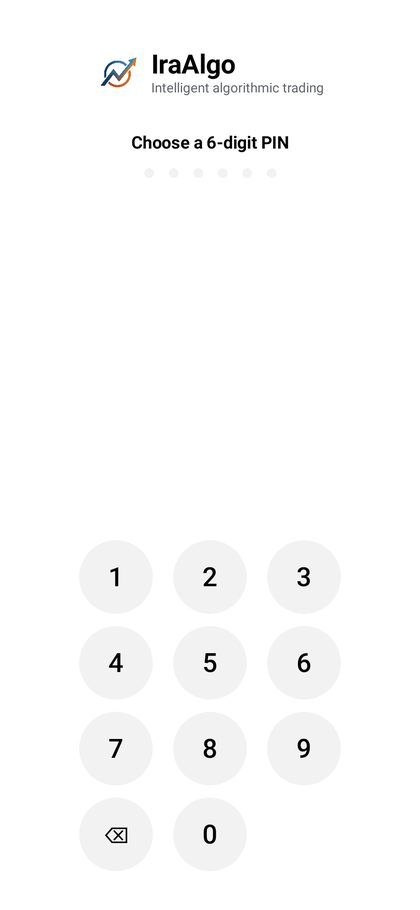

**Create your PIN**

1. Choose a 6-digit PIN and enter it again to confirm.
2. Accept the offer to unlock with your fingerprint. The PIN still works as a fallback, and it is required before
   any live order and for security changes.
3. Screenshots and screen recording are blocked by default. You can allow them for a while under
   **More → Security** (PIN required); turn it off again afterwards.

<br clear="right">

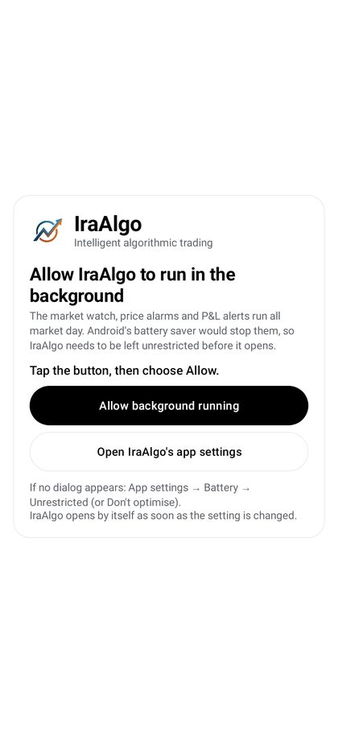

**Allow background running**

1. Tap **Allow background running**, then **Allow** in Android's dialog.
2. If no dialog appears: **Open IraAlgo's app settings → Battery → Unrestricted** (some phones call it
   "Don't optimise").
3. The app opens by itself once the setting changes. Without it, Android stops the market watch, alerts and the
   strategy arms when the screen is off.

Some phones (Xiaomi, Oppo, Vivo, Realme, OnePlus) also have an **Auto-start** switch in the app's settings: turn it on.

IraAlgo then shows **Connect to Zerodha**; the app opens fully once an account is linked. IraGoldAlgo goes straight
to its Home screen (section 10).

<br clear="right">

## 4. Zerodha and Kite Connect

IraAlgo talks to Zerodha through Kite Connect, Zerodha's official API. You create your own Kite Connect app; its
key and secret live only in IraAlgo's encrypted vault on your phone.

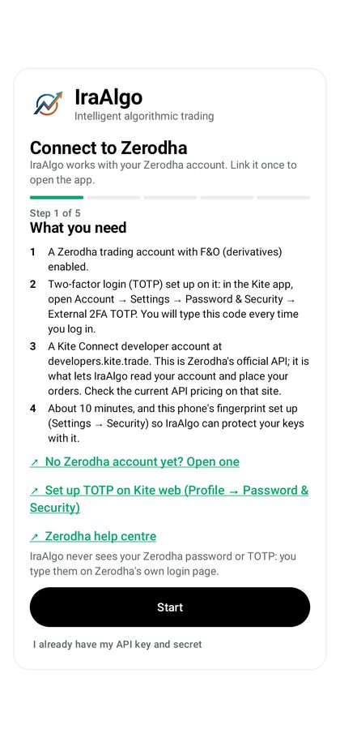

**4.1 Prepare your Zerodha account**

1. F&O must be active: **console.zerodha.com → Account → Segments**.
2. Turn on TOTP: in the Kite app **Account → Settings → Password & Security → External 2FA TOTP**, or on Kite web
   **Profile → Password & Security**. Scan the QR code with an authenticator app.
3. In IraAlgo's Connect screen, read step 1 and tap **Start**. The guide walks you through the next steps with
   links to the right pages.

<br clear="right">

**4.2 Create the Kite Connect app**

1. Go to [developers.kite.trade](https://developers.kite.trade/) and sign up (or log in) with your email and
   mobile number. If asked, add credits or choose the plan for API access there.
2. Open **My apps → Create new app** and fill in:
   - **Type:** Connect
   - **App name:** IraAlgo (any name works)
   - **Zerodha Client ID:** your user ID, for example AB1234
   - **Redirect URL:** exactly `http://127.0.0.1/iraalgo`
   - **Postback URL:** leave empty. **Description:** anything, e.g. "personal trading".
3. Tap **Create**.

The redirect address never opens a website: when you log in, IraAlgo catches it inside the app and reads the
login token from it.

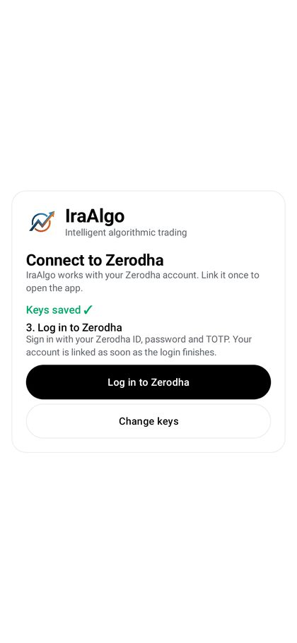

**4.3 Copy the key and secret into IraAlgo**

1. In **My apps**, open the app you just made. Copy the **API key**.
2. In IraAlgo's step 5, tap **Paste** next to the API key.
3. Back on the site, tap **Show API secret**, copy it, and paste it into IraAlgo the same way. Treat the secret
   like a password: never share it or screenshot it.
4. Save. The secret is sealed with your PIN (and fingerprint, if on) and is never shown again.
5. Tap **Log in to Zerodha**. Zerodha's own login page opens inside the app: enter your user ID, password and
   TOTP. IraAlgo never sees them.
6. When the login finishes, the account is linked and the full app opens.

<br clear="right">

> Zerodha ends every API session early each morning, and individual Kite Connect apps get no refresh token: log in
> once per trading day (**More → Zerodha → Log in to Zerodha**). IraAlgo reminds you before the open.

## 5. Static IP with Oracle Cloud

Since 1 April 2026, SEBI requires API orders to come from an IP address registered with your broker. A phone's IP
changes all the time, so IraAlgo sends its Zerodha order calls through a small server of yours whose public IP never
changes. The server only forwards encrypted bytes it cannot read: your keys, token and orders stay on the phone, and
nothing is installed on the server.

```
IraAlgo on the phone  --SSH, the app's own key-->  your Oracle server (fixed IP)  --HTTPS-->  api.kite.trade
```

Only the order calls and the IP check travel through the server; quotes, charts and everything else go direct.
Exits always go, even with the relay off, so you can never be trapped in a position.

**5.1 Create the Oracle account**

1. Sign up at [signup.cloud.oracle.com](https://signup.cloud.oracle.com/).
2. Choose **India West (Mumbai)** or **India South (Hyderabad)** as the **home region**. It cannot be changed later,
   and Always Free resources exist only in the home region.
3. Verify with your card (Oracle places a small temporary hold; Always Free resources are not charged).
4. Sign in to the console at [cloud.oracle.com](https://cloud.oracle.com/).

**5.2 Reserve a public IP**

1. Console menu **☰ → Networking → IP management → Reserved public IPs**.
2. **Reserve public IP address**, give it a name (e.g. `iraalgo-ip`), keep the default compartment, **Reserve**.
3. Write the IP down (for example `144.24.125.164`). This is the address Zerodha will see, and it stays yours even
   if you rebuild the server.

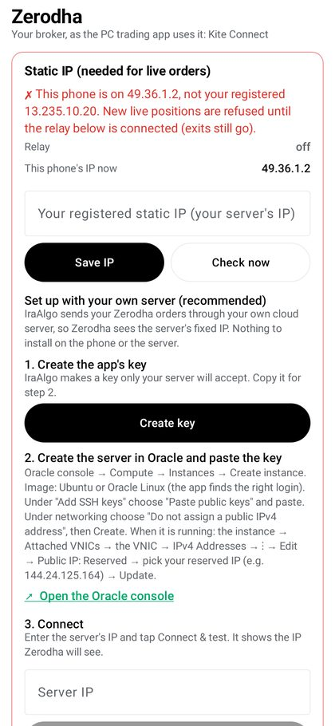

**5.3 Make the app's key**

1. In IraAlgo: **More → Zerodha**, card **Static IP (needed for live orders)**.
2. Under **Set up with your own server**, tap **Create key**. The phone makes a key pair; only the public half is
   shown.
3. Tap **Copy** next to the key.

<br clear="right">

**5.4 Create the server**

1. Console: **☰ → Compute → Instances → Create instance**.
2. **Name:** `iraalgo-relay`. **Placement:** leave as it is.
3. **Image:** Canonical Ubuntu (22.04 or 24.04). Oracle Linux also works: the app finds the right login (`ubuntu`
   or `opc`).
4. **Shape:** an Always Free one: `VM.Standard.E2.1.Micro` (AMD) or `VM.Standard.A1.Flex` with 1 OCPU and 6 GB
   (Ampere). Look for the "Always Free-eligible" label.
5. **Networking:** keep the default VCN and public subnet (create them if the form offers to). Choose **Do not
   assign a public IPv4 address**: the reserved IP is attached in the next step.
6. **Add SSH keys:** choose **Paste public keys** and paste the key copied from IraAlgo.
7. **Create**, and wait until the state shows **Running**.

**5.5 Attach the reserved IP**

1. Open the instance → **Attached VNICs** (under Resources) → the primary VNIC.
2. **IPv4 Addresses** → the **⋮** menu on the private IP → **Edit**.
3. **Public IP type:** Reserved public IP → choose the one from 5.2 → **Update**.
4. The instance now shows your reserved IP as its public IP.

Nothing else to open: SSH (TCP port 22) is allowed by the default security list, and the relay needs nothing more.
If you changed the security list, add an ingress rule for TCP 22.

**5.6 Connect the app**

1. Back in IraAlgo's Static IP card, type the reserved IP in **Server IP** and tap **Connect & test**.
2. The first connect remembers the server's identity; any later change is refused (use **Forget server** only if
   you rebuilt it).
3. Success reads **"✓ Connected. Zerodha will see your orders from 144.24.125.164."** and the switch shows
   **Orders go through your server**.
4. The IP is also saved as your registered IP, so the app checks every new live order against it.

## 6. Register the IP with Zerodha

1. Open [developers.kite.trade/apps](https://developers.kite.trade/apps) and select your IraAlgo app.
2. Find the static IP setting (Zerodha may label it "IP whitelist" or "Static IP") and enter the server's IP
   exactly as IraAlgo showed it. Save.
3. In IraAlgo, **More → Zerodha → Static IP → Check now** must show **"✓ This phone is on your registered IP …
   Live orders can go."**

If the card turns red ("This phone is on …, not your registered …"), new live positions are refused until the relay
reconnects. Exits still go.

*Advanced:* the app also supports a WireGuard VPN on the same server instead of the built-in relay: see
[static-ip-relay.md](static-ip-relay.md). The built-in relay is simpler and is what the app recommends.

## 7. Limits, security, alerts

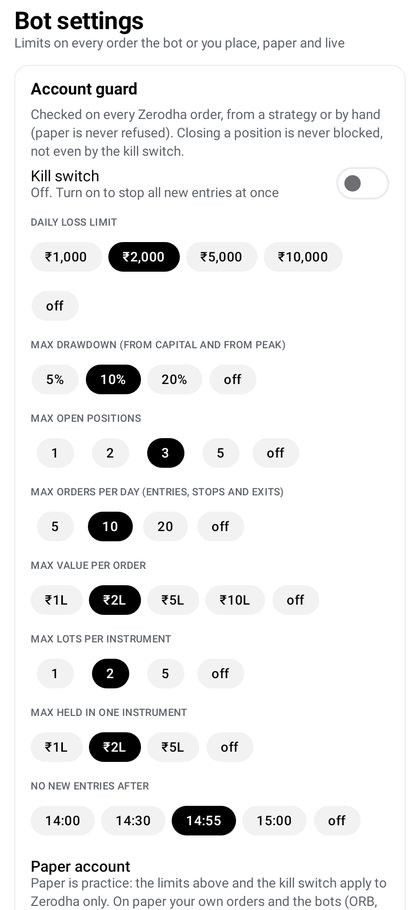

**Bot settings** (**More → Bot settings**), the account-wide guard. Set these before going live; every order, paper
or live, strategy or manual, passes through them.

- **Kill switch:** stops all new entries at once. Exits are still allowed.
- **Daily loss** and **drawdown** limits, **max open positions**, **max trades a day**, **max order value**,
  **max lots**.
- **No new entries after:** a cut-off for Zerodha orders. It can only make the strategies stop earlier, never later.

<br clear="right">

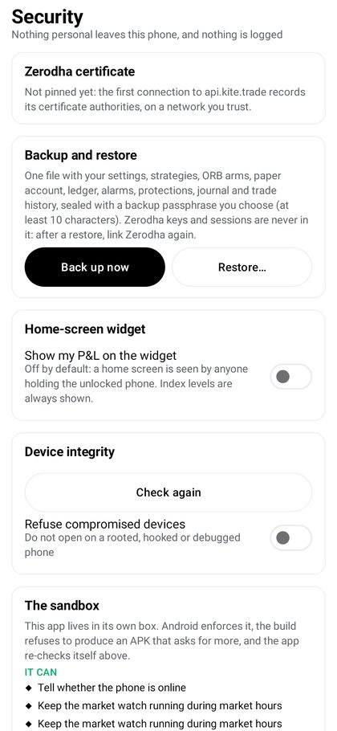

**Security** (**More → Security**): PIN, fingerprint, the idle lock, the device check (a rooted or tampered phone is
refused live orders), screenshots on/off, and what the home-screen widget shows. The page also lists every Android
permission the app holds and what it can never do (read SMS, mail, contacts, files or other apps).

<br clear="right">

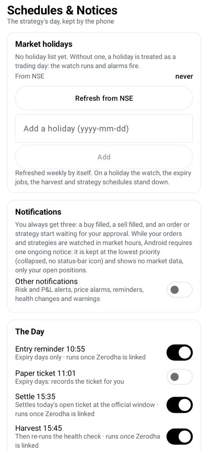

**Alerts and schedules**

- **More → Alerts:** price alarms on any symbol, and P&L alerts when the day's loss or profit reaches your level.
- **More → Schedules:** daily jobs, which notifications you get beyond buy / sell / approval, and the NSE holiday
  list (fetched weekly, editable).

<br clear="right">

## 8. First live check

About 10 minutes, costs nothing. Do it once after each new build, during market hours, with the relay connected.

1. **More → Zerodha:** logged in for today; the top badge shows **LIVE**; kill switch off.
2. **Live self-test:** **More → Zerodha → Live self-test → Run the self-test**. Every check must show ✓, "Static IP
   for orders" included.
3. Place an order that cannot fill: a far out-of-the-money NIFTY option, BUY 1 lot, LIMIT ₹0.05, NRML. Review, hold
   to send, enter the PIN. It shows **OPEN** in the app and in Kite.
4. Modify it to ₹0.10, then cancel it. It shows **CANCELLED** in both; funds unchanged.
5. Safety gates: with the badge on PAPER a live order is refused; with the kill switch on a new BUY is refused; a
   wrong PIN sends nothing.

The full list is in [LIVE_CHECKLIST.md](../LIVE_CHECKLIST.md).

## 9. Every trading day

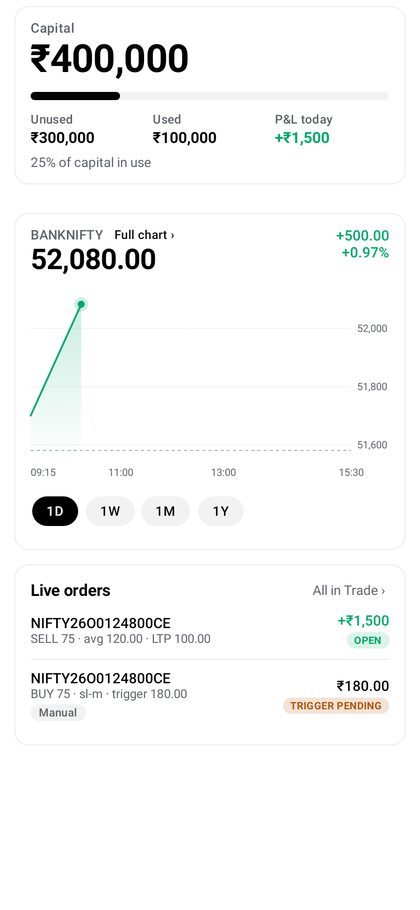

1. Before 09:15 IST: open IraAlgo and **Log in to Zerodha** (ID, password, TOTP).
2. Check the Static IP card is green and the badge shows the mode you want (PAPER or LIVE).
3. The arms (ORB, ORB Fresh, ORB Sweep, Range Fade, Liquidity 15+5) run by themselves on the paper account each
   day; you can stop them for the day from the Strategies card on Home.
4. Fills arrive as notifications with a large green BUY or red SELL tile; open positions stay as cards with a
   Close button.
5. After the close, the P&L tab shows the day, its trades and charges.

<br clear="right">

## 10. IraGoldAlgo

XAUUSD, one strategy (the 1-hour liquidity break, buys only, 24 hours a day Monday to Friday), on paper. It sends a
notification for every paper buy and sell and never connects to a broker. If you act on a signal, you do it yourself
in your own broker app (for example XM).

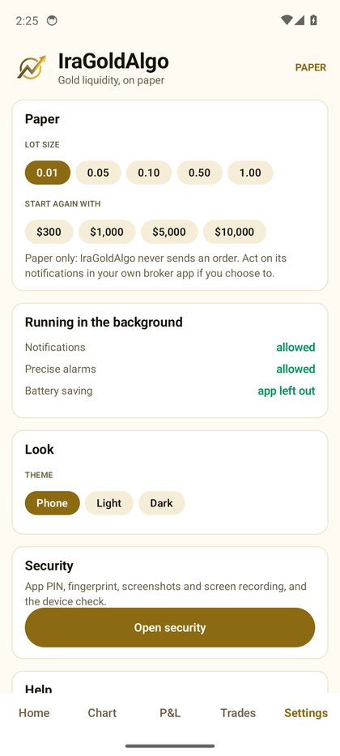

**Setup**

1. Install `IraGoldAlgo.apk` (section 2), create its PIN and allow background running (section 3).
2. Allow notifications when Android asks. Without them the buys and sells are silent.
3. **Settings → Running in the background:** all three lines should be green. If one is not, tap its button:
   - **Notifications** blocked → **Allow notifications**
   - **Precise alarms** off → **Allow alarms** (without them an idle phone checks late and can miss a candle)
   - **Battery saving** on → **Battery**
4. **Settings → Paper:** choose the lot size and starting amount. On $500, 0.01 lot (1 oz) is sensible; larger lots
   scale the drawdown with them.
5. Home: turn on **Armed**. The arm starts off and does nothing until you do.
6. Optional: the second arm, **Trend 4h**, further down Home, has its own **Armed** switch. It buys while gold's
   4-hour trend (Supertrend 10, 3) points up and sells when a 4-hour candle closes with the trend down, or earlier by
   its profit lock (once 1 ATR up, a fall of 4 ATRs from the top). It decides about 10 minutes after each 4-hour close
   (00:00, 04:00 … 20:00 UTC) and holds overnight and over weekends (swap). Its falls are deep: allow about $2,000 per
   0.01 lot. All arms share the lot size and the paper account; Trades and P&L show them all, each trade named for its arm.
7. Optional: **Dip 1h+30m** and **TAS 1h** have their own **Armed** switches too. TAS 1h buys when the 1-hour trend
   tracker (from the "Trend Analysis Strategy", ATR 19) turns up with a trend score of +50% or more, puts its stop on
   the tracker line and sells all of it when a 1-hour candle closes with the tracker down (no targets). One buy per
   up-turn; held overnight.

<br clear="right">

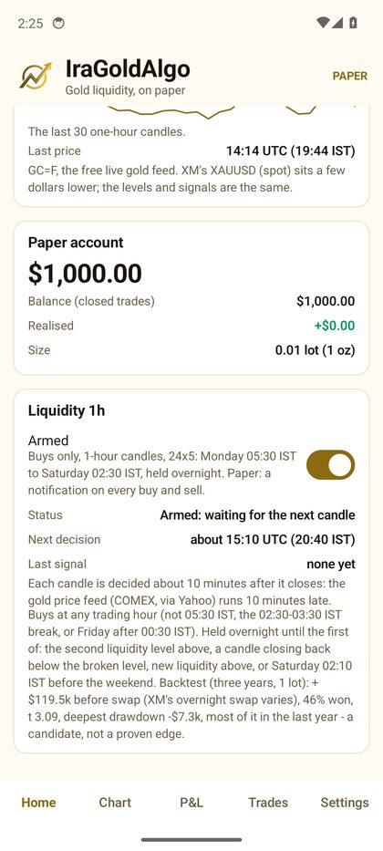

**Reading Home**

- **Status:** what the last decision found ("Armed: waiting for the next candle", "No liquidity break on the 12:00
  UTC candle", "Bought at …").
- **Next decision:** when the next candle is decided, about 10 minutes after it closes, because the gold price feed
  runs 10 minutes late.
- Buys at any trading hour, but not at 05:30 IST, not in the 02:30–03:30 IST break, and not on Friday after
  00:30 IST (Saturday morning in India). Held overnight until the second liquidity level above, a close back below
  the broken level, new liquidity above, or the Saturday 02:10 IST cut-off.

Signals come in bursts. Over the three years tested there were about 160 trades, roughly one a week on average,
with quiet spells of several weeks (none from 22 August to the end of September 2026). No trade for a while does not
mean the arm is broken.

<br clear="right">

<p>
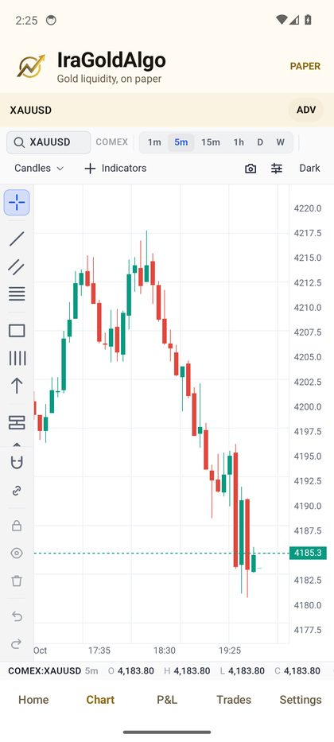
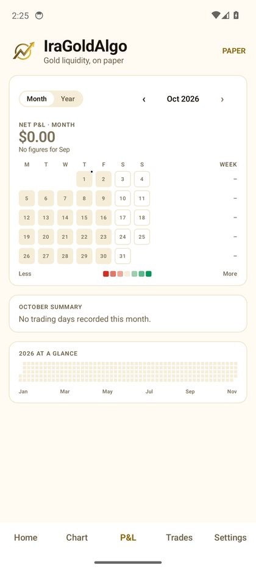
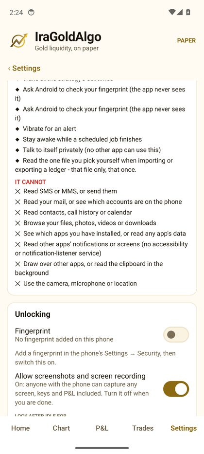
</p>

Chart (IraAlgo's chart on gold, no order buttons) · P&L (the calendar in dollars) · Settings → Open security.

## 11. Troubleshooting

| What you see | Why | What to do |
|---|---|---|
| Orders rejected with an IP message | The relay is off, or the registered IP differs from the server's | More → Zerodha → Static IP: Connect & test, then Check now. The IP at developers.kite.trade must match exactly. |
| "The server refused the app's key" | The pasted key is not on the server | Rebuild the instance with the key pasted, or add it to `~/.ssh/authorized_keys` for `ubuntu` (Ubuntu) or `opc` (Oracle Linux). |
| Connect & test times out | No public IP on the instance, or port 22 blocked | Check 5.5 (reserved IP attached) and that the subnet's security list allows TCP 22. |
| "The server's identity changed" | The instance was rebuilt behind the same IP | Only if you rebuilt it yourself: Forget server, then Connect & test. |
| Kite login says the redirect URL is wrong | The Redirect URL in your Kite app differs | Set it to `http://127.0.0.1/iraalgo` exactly, no trailing slash. |
| Logged out every morning | Zerodha ends API sessions daily | Expected: log in once each trading day. |
| No notifications | Android notification permission is off | Allow it in the app's Android settings (IraGoldAlgo: Settings → Running in the background). |
| IraGoldAlgo "Missed the … candle" | The phone ran the check more than 20 minutes after the candle's prices arrived | Allow precise alarms and leave the app out of battery saving. |
| "Price feed delayed" in red | No gold price for over 20 minutes during trading hours | Check the internet connection; the feed normally runs 10 minutes behind. |
| Update will not install | A build signed with a different key | Only install builds from the latest-apk release; they all share one signing key. |

---

Never share your API secret, TOTP or PIN, and never send screenshots of them. IraGoldAlgo's figures are backtests
on past data, not a promise of future returns.
